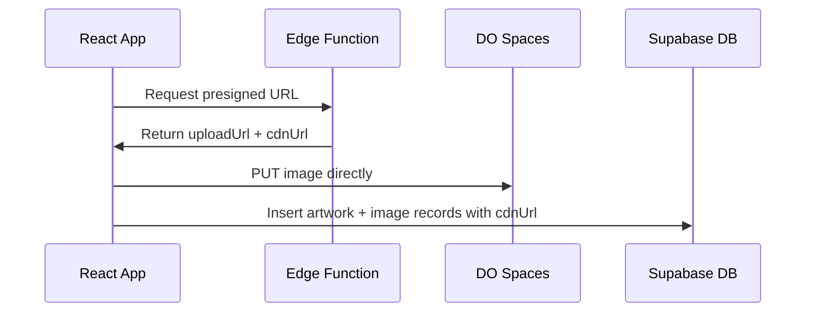
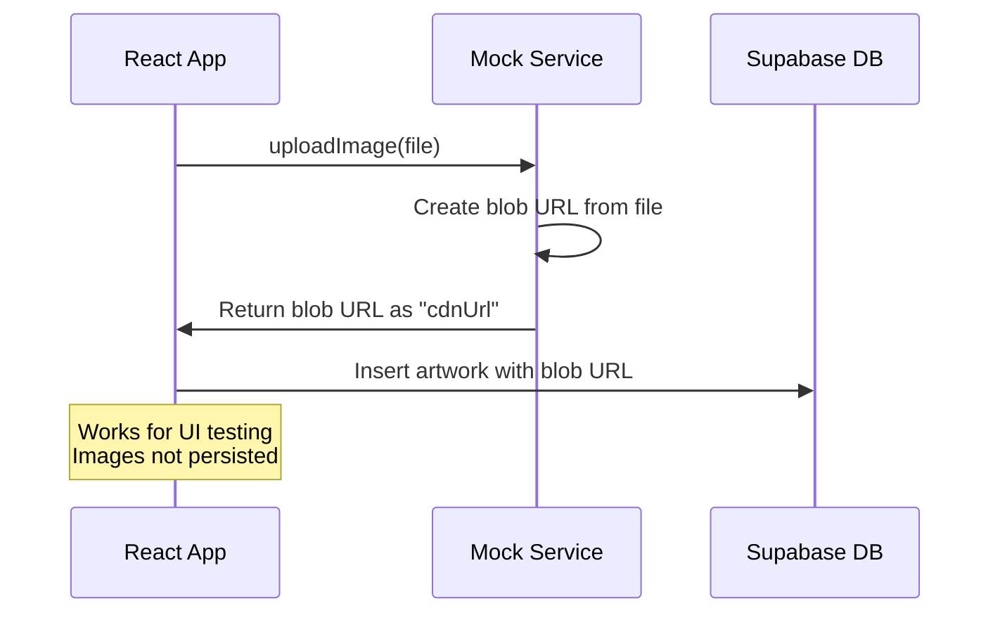
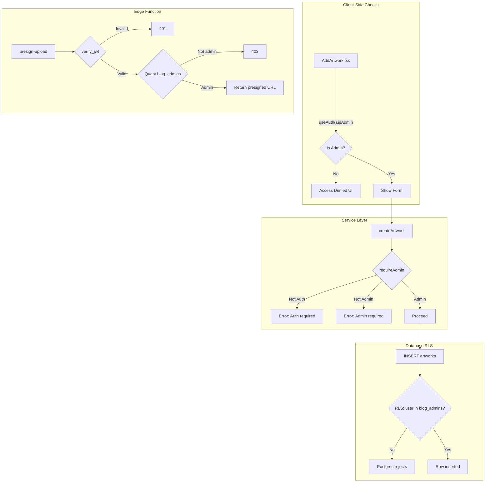

# DigitalOcean Spaces Image Upload Integration

## Architecture

### Production Flow




### Local Development Flow




## Local Development Support

The upload service will automatically detect `import.meta.env.DEV` and switch to mock mode:**Mock Mode** (default in dev):

- No real uploads - uses browser blob URLs
- No credentials needed
- Perfect for UI development and testing form flows
- Images display correctly but aren't persisted across sessions

**Real Mode** (opt-in for local testing):

- Set `VITE_USE_REAL_UPLOAD=true` in `.env.local`
- Requires Supabase Edge Function running locally (`supabase functions serve`)
- Actually uploads to DO Spaces

### Security in Mock Mode

- Zero credentials exposed - mock generates fake URLs client-side
- Mock mode ONLY activates when `import.meta.env.DEV === true`
- Production builds always use real upload flow
- No secrets in frontend code ever

## Changes Overview

### 1. Create Supabase Edge Function

Deploy a new edge function `presign-upload` that:

- Accepts filename and content type
- Uses AWS S3 SDK (DO Spaces is S3-compatible) to generate presigned PUT URL
- Returns both the upload URL and the resulting CDN URL
- Requires authentication (JWT verification)

The function will need these secrets set in Supabase:

- `DO_SPACES_KEY` - your DigitalOcean Spaces access key
- `DO_SPACES_SECRET` - your secret key
- `DO_SPACES_BUCKET` - bucket name
- `DO_SPACES_REGION` - e.g., `nyc3`

### 2. Create Frontend Upload Service

New file: [`src/services/s3-upload.ts`](src/services/s3-upload.ts)

- `getPresignedUrl(filename, contentType)` - calls the edge function
- `uploadToS3(file)` - gets presigned URL, uploads file, returns CDN URL

### 3. Update AddArtwork Component

Modify [`src/pages/ArtworkGrid/AddArtwork.tsx`](src/pages/ArtworkGrid/AddArtwork.tsx):

- Remove Cloudinary TODO comment (line 122)
- Import the new S3 upload service
- On form submit: upload images to S3, then create artwork record with CDN URLs

### 4. Add Artwork Creation API

The form currently doesn't create artworks in the database. We'll add:

- A `createArtwork` function in [`src/services/artwork-service.ts`](src/services/artwork-service.ts)
- Direct Supabase insert for artwork + artwork_images records

### 5. Environment Variables

**Frontend** (in `.env` / `.env.local`):

- `VITE_SUPABASE_URL` (already exists)
- `VITE_USE_REAL_UPLOAD` - optional, set to `true` to use real uploads in dev

**Edge Function Secrets** (set via Supabase dashboard or CLI):

- `DO_SPACES_KEY` - DigitalOcean Spaces access key
- `DO_SPACES_SECRET` - DigitalOcean Spaces secret key
- `DO_SPACES_BUCKET` - bucket name
- `DO_SPACES_REGION` - e.g., `nyc3`

## Files to Modify

| File | Change ||------|--------|| Edge function via MCP | Deploy `presign-upload` function || `src/services/s3-upload.ts` | New upload service with mock mode || `src/pages/ArtworkGrid/AddArtwork.tsx` | Wire up upload flow || `src/services/artwork-service.ts` | Add createArtwork function || `src/vite-env.d.ts` | Add VITE_USE_REAL_UPLOAD type |

## Prerequisites (Your Action Required)

Before I execute, you'll need your DigitalOcean Spaces credentials ready:

1. **Spaces Access Key** and **Secret Key** from DO dashboard
2. **Bucket name** and **region** (e.g., `nyc3`)
3. **CDN enabled** on the bucket

## Testing Locally

```bash
# Option 1: Mock mode (default) - no setup needed
pnpm dev

# Option 2: Real uploads locally
# 1. Set secrets in Supabase dashboard first
# 2. Then in .env.local:
VITE_USE_REAL_UPLOAD=true


Security flow:

